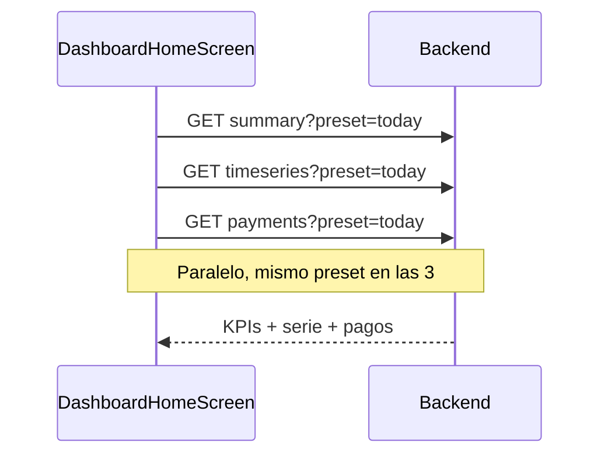
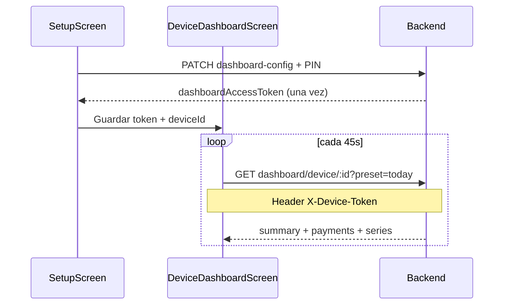

# Dashboard operativo — Contrato API para Frontend (Flutter)

**Estado backend:** implementado y desplegable.  
**Base URL:** `{API_BASE_URL}/api/v1` (misma que el POS, p. ej. `http://10.0.2.2:3000/api/v1` en emulador Android).  
**Guía de pantallas / UX:** `docs/mini-sprint-dashboard-pos-FRONTEND.md`  
**Referencia técnica backend:** `docs/api/REPORTS.md`

---

## 1. Convenciones globales

| Tema | Regla |
|------|--------|
| Header tienda | `X-Store-Id: <uuid>` en todos los endpoints de reportes y en GET config (igual que el resto del POS). |
| Montos | Siempre `String` decimal (no `double` en JSON). Formatear en UI. |
| Moneda mostrada | `currencyCode` = moneda **funcional** de la tienda (`BusinessSettings`). |
| Errores | `{ "statusCode": number, "error": string, "message": string[], "requestId": string }` |
| Fechas en query | `YYYY-MM-DD` (calendario en zona de la tienda, ver `timezone` en respuesta). |
| Rango máximo | 31 días inclusive; si se excede → `400` con mensaje en `message[]`. |
| Ventas / devoluciones contadas | Solo `status = CONFIRMED` (el backend filtra; el front no debe restar borradores). |

### KPIs (solo lectura; no recalcular en el cliente)

| Campo API | Significado |
|-----------|-------------|
| `grossSales` | Suma ventas confirmadas en moneda funcional |
| `returns` | Suma devoluciones confirmadas en moneda funcional |
| `netSales` | `grossSales - returns` (ya viene calculado) |
| `tickets` | Cantidad de ventas confirmadas |
| `avgTicket` | `netSales / tickets` (si `tickets = 0` → `"0"`) |
| `returnRate` | `returns / grossSales` como string, o `null` si no hay ventas brutas |

---

## 2. Qué endpoint usa cada pantalla

| Pantalla (Flutter) | Endpoints | Headers |
|--------------------|-----------|---------|
| **DashboardHomeScreen** (operador) | `summary`, `timeseries`, `payments` (3 llamadas en paralelo) | `X-Store-Id` |
| **DeviceDashboardScreen** (TV / kiosk) | `GET /dashboard/device/:deviceId` (una sola llamada) | `X-Device-Token` (sin `X-Store-Id`) |
| **DeviceDashboardSetupScreen** (admin) | `PATCH .../dashboard-config` | `X-Store-Id` + `X-Dashboard-Admin-Pin` |
| Consultar modo dispositivo | `GET .../dashboard-config` | `X-Store-Id` |
| Opcional: comparar cajas | `GET .../by-device` | `X-Store-Id` |

---

## 3. Query params comunes (`SalesReportQuery`)

Usar en: `summary`, `timeseries`, `payments`, `by-device`, `dashboard/device`.

| Parámetro | Tipo | Obligatorio | Descripción |
|-----------|------|-------------|-------------|
| `preset` | string | No* | `today` \| `yesterday` \| `week` \| `month`. Si va presente, **ignora** `dateFrom`/`dateTo`. |
| `dateFrom` | string | No | Inicio inclusive `YYYY-MM-DD` |
| `dateTo` | string | No | Fin inclusive `YYYY-MM-DD` |
| `deviceId` | string | No | Mismo `deviceId` que ventas/sync; filtra ventas y devoluciones de ventas de ese terminal |

\* Si no envías `preset` ni fechas: el backend usa **últimos 7 días** en la zona de la tienda.

### Mapeo UI → query

| Chip / filtro UI | Query |
|------------------|--------|
| Hoy | `preset=today` |
| Ayer | `preset=yesterday` |
| Esta semana | `preset=week` |
| Este mes | `preset=month` |
| Rango personalizado | `dateFrom=2026-06-01&dateTo=2026-06-15` |

---

## 4. Endpoints de reportes (DashboardHome)

### 4.1 `GET /reports/sales/summary`

**Request**

```http
GET /api/v1/reports/sales/summary?preset=today
X-Store-Id: 550e8400-e29b-41d4-a716-446655440000
```

**Response `200`**

```json
{
  "storeId": "550e8400-e29b-41d4-a716-446655440000",
  "currencyCode": "USD",
  "from": "2026-06-08",
  "to": "2026-06-08",
  "timezone": "America/Caracas",
  "rangeInterpretation": "Calendar dates dateFrom/dateTo are interpreted in store timezone \"America/Caracas\" ...",
  "preset": "today",
  "grossSales": "1250.50",
  "returns": "45.00",
  "netSales": "1205.50",
  "tickets": 32,
  "avgTicket": "37.671875",
  "returnRate": "0.035985606557377"
}
```

| Campo | Tipo JSON | Uso en UI |
|-------|-----------|-----------|
| `storeId` | string (uuid) | Contexto |
| `currencyCode` | string | Etiqueta en cards (“USD”) |
| `from`, `to` | string | Subtítulo del período |
| `timezone` | string | Info / debug |
| `rangeInterpretation` | string | Tooltip opcional |
| `preset` | string? | Solo si se usó preset |
| `grossSales` | string | Card “Ventas brutas” |
| `returns` | string | Card “Devoluciones” |
| `netSales` | string | Card principal |
| `tickets` | number | Card “Tickets” |
| `avgTicket` | string | Card “Ticket promedio” |
| `returnRate` | string \| null | Opcional % devolución |

---

### 4.2 `GET /reports/sales/timeseries`

**Request**

```http
GET /api/v1/reports/sales/timeseries?preset=week
X-Store-Id: 550e8400-e29b-41d4-a716-446655440000
```

**Response `200`**

```json
{
  "meta": {
    "timezone": "America/Caracas",
    "from": "2026-06-02",
    "to": "2026-06-08",
    "rangeInterpretation": "...",
    "groupBy": "day",
    "preset": "week"
  },
  "points": [
    {
      "bucket": "2026-06-02",
      "grossSales": "180.00",
      "returns": "0.00",
      "netSales": "180.00",
      "tickets": 5
    },
    {
      "bucket": "2026-06-08",
      "grossSales": "250.00",
      "returns": "10.00",
      "netSales": "240.00",
      "tickets": 18
    }
  ]
}
```

| Campo | Tipo | Uso en UI |
|-------|------|-----------|
| `meta.groupBy` | `"day"` | Fijo en v1 |
| `points[].bucket` | string `YYYY-MM-DD` | Eje X del gráfico |
| `points[].netSales` | string | Serie principal recomendada |
| `points[].grossSales` | string | Serie opcional |
| `points[].returns` | string | Serie opcional |
| `points[].tickets` | number | Tooltip |

Si `points` está vacío → empty state “Sin ventas en el período”.

---

### 4.3 `GET /reports/sales/payments`

**Request**

```http
GET /api/v1/reports/sales/payments?preset=today
X-Store-Id: 550e8400-e29b-41d4-a716-446655440000
```

**Response `200`**

```json
{
  "storeId": "550e8400-e29b-41d4-a716-446655440000",
  "currencyCode": "USD",
  "from": "2026-06-08",
  "to": "2026-06-08",
  "timezone": "America/Caracas",
  "preset": "today",
  "items": [
    { "method": "USD_CASH", "amount": "420.00" },
    { "method": "VES_CASH", "amount": "380.50" },
    { "method": "CARD", "amount": "450.00" }
  ]
}
```

| Campo | Tipo | Uso en UI |
|-------|------|-----------|
| `items[].method` | string | Código crudo; mapear a etiqueta legible en UI |
| `items[].amount` | string | Monto en moneda funcional |

Lista ordenada alfabéticamente por `method`.

---

### 4.4 `GET /reports/sales/by-device` (opcional v1)

**Request**

```http
GET /api/v1/reports/sales/by-device?preset=today
X-Store-Id: 550e8400-e29b-41d4-a716-446655440000
```

**Response `200`**

```json
{
  "storeId": "550e8400-e29b-41d4-a716-446655440000",
  "currencyCode": "USD",
  "from": "2026-06-08",
  "to": "2026-06-08",
  "items": [
    {
      "deviceId": "a1b2c3d4-install-uuid",
      "grossSales": "800.00",
      "returns": "20.00",
      "netSales": "780.00",
      "tickets": 20
    },
    {
      "deviceId": null,
      "grossSales": "450.50",
      "returns": "25.00",
      "netSales": "425.50",
      "tickets": 12
    }
  ]
}
```

`deviceId: null` = ventas sin terminal registrado.

---

## 5. Kiosk — una sola llamada

### 5.1 `GET /dashboard/device/:deviceId`

**Path:** `deviceId` = identificador de instalación del POS (el mismo que envían en `sync/push` y `POST /sales`), **no** el UUID interno de fila `POSDevice.id`.

**Request**

```http
GET /api/v1/dashboard/device/a1b2c3d4-install-uuid?preset=today
X-Device-Token: f8a1b2c3d4e5f6789012345678901234567890abcdef1234567890abcdef123456
```

**No enviar** `X-Store-Id` en esta ruta.

**Response `200`**

```json
{
  "device": {
    "id": "f47ac10b-58cc-4372-a567-0e02b2c3d479",
    "deviceId": "a1b2c3d4-install-uuid",
    "storeId": "550e8400-e29b-41d4-a716-446655440000",
    "dashboardEnabled": true,
    "deviceMode": "DASHBOARD",
    "dashboardView": "SALES_SUMMARY"
  },
  "filters": {
    "preset": "today",
    "storeId": "550e8400-e29b-41d4-a716-446655440000",
    "from": "2026-06-08",
    "to": "2026-06-08",
    "timezone": "America/Caracas"
  },
  "summary": {
    "grossSales": "250.00",
    "returns": "10.00",
    "netSales": "240.00",
    "tickets": 18,
    "avgTicket": "13.333333333333333333333333333",
    "currencyCode": "USD"
  },
  "payments": [
    { "method": "USD_CASH", "amount": "120.00" },
    { "method": "VES_CASH", "amount": "80.00" }
  ],
  "series": [
    {
      "bucket": "2026-06-08",
      "grossSales": "250.00",
      "returns": "10.00",
      "netSales": "240.00",
      "tickets": 18
    }
  ]
}
```

**Refresh recomendado:** cada 45–60 s con el mismo `preset=today`.

**Errores**

| HTTP | Cuándo | UX |
|------|--------|-----|
| `401` | Token ausente/incorrecto o dispositivo inexistente | Pantalla “No autorizado” + flujo reconfigurar |
| `403` | `dashboardEnabled = false` o `deviceMode = POS` | “Dashboard desactivado” |
| `404` | Dispositivo no existe | Revisar `deviceId` guardado |

---

## 6. Configuración de dispositivo (admin)

`:deviceId` en path = mismo ID de instalación que en ventas/sync.

### 6.1 `GET /pos-devices/:deviceId/dashboard-config`

**Request**

```http
GET /api/v1/pos-devices/a1b2c3d4-install-uuid/dashboard-config
X-Store-Id: 550e8400-e29b-41d4-a716-446655440000
```

**Response `200`**

```json
{
  "id": "f47ac10b-58cc-4372-a567-0e02b2c3d479",
  "deviceId": "a1b2c3d4-install-uuid",
  "storeId": "550e8400-e29b-41d4-a716-446655440000",
  "dashboardEnabled": false,
  "deviceMode": "POS",
  "dashboardView": "SALES_SUMMARY",
  "hasDashboardToken": false,
  "lastHeartbeatAt": null,
  "lastSeen": "2026-06-08T14:22:00.000Z",
  "appVersion": "1.2.0"
}
```

| Campo | Tipo | Notas |
|-------|------|-------|
| `deviceMode` | `"POS"` \| `"DASHBOARD"` \| `"HYBRID"` | Decidir shell al arranque |
| `dashboardView` | `"SALES_SUMMARY"` | Única vista en v1 |
| `hasDashboardToken` | boolean | Si false en modo DASHBOARD, hay que hacer PATCH con `regenerateToken` |
| `lastHeartbeatAt` | string ISO \| null | Actualizado en cada GET kiosk |

---

### 6.2 `PATCH /pos-devices/:deviceId/dashboard-config`

**Request**

```http
PATCH /api/v1/pos-devices/a1b2c3d4-install-uuid/dashboard-config
X-Store-Id: 550e8400-e29b-41d4-a716-446655440000
X-Dashboard-Admin-Pin: <mismo valor que CONFIG_ADMIN_PIN / DASHBOARD_ADMIN_PIN del servidor>
Content-Type: application/json

{
  "dashboardEnabled": true,
  "deviceMode": "DASHBOARD",
  "dashboardView": "SALES_SUMMARY",
  "regenerateToken": true
}
```

**Body (todos opcionales)**

| Campo | Tipo | Descripción |
|-------|------|-------------|
| `dashboardEnabled` | boolean | Activa acceso kiosk |
| `deviceMode` | enum | `POS`, `DASHBOARD`, `HYBRID` |
| `dashboardView` | enum | Solo `SALES_SUMMARY` en v1 |
| `regenerateToken` | boolean | Genera nuevo token; invalida el anterior |

**Response `200` (con token nuevo)**

```json
{
  "id": "f47ac10b-58cc-4372-a567-0e02b2c3d479",
  "deviceId": "a1b2c3d4-install-uuid",
  "storeId": "550e8400-e29b-41d4-a716-446655440000",
  "dashboardEnabled": true,
  "deviceMode": "DASHBOARD",
  "dashboardView": "SALES_SUMMARY",
  "hasDashboardToken": true,
  "lastHeartbeatAt": null,
  "lastSeen": "2026-06-08T14:22:00.000Z",
  "appVersion": "1.2.0",
  "dashboardAccessToken": "f8a1b2c3d4e5f6789012345678901234567890abcdef1234567890abcdef123456"
}
```

**Importante:** `dashboardAccessToken` solo aparece en esta respuesta cuando se genera/regenera. Guardarlo en **secure storage** del dispositivo kiosk. No se puede recuperar después con GET.

**Auth PATCH:** header `X-Dashboard-Admin-Pin` debe coincidir con `DASHBOARD_ADMIN_PIN` del servidor. Alternativa operaciones: `X-Ops-Api-Key` = `OPS_API_KEY`.

Si `dashboardEnabled: false` → el backend borra el hash del token.

---

## 7. Flujos de integración

### 7.1 Dashboard operador (dentro del POS)



Al cambiar filtro → repetir las 3 con el mismo query.

### 7.2 Tablet TV (kiosk)



### 7.3 Arranque de la app según modo

1. Leer `deviceId` local (ya existe para sync).
2. `GET dashboard-config` con `X-Store-Id`.
3. Si `deviceMode == DASHBOARD` y `hasDashboardToken` → ir a `DeviceDashboardScreen`.
4. Si `HYBRID` → home con acceso al módulo dashboard.
5. Si `POS` → flujo actual sin cambios.

---

## 8. Modelos Dart sugeridos (referencia)

```dart
class DashboardSummary {
  final String storeId;
  final String currencyCode;
  final String from;
  final String to;
  final String grossSales;
  final String returns;
  final String netSales;
  final int tickets;
  final String avgTicket;
  final String? returnRate;
  // fromJson: todos los montos como String, tickets como int
}

class TimeSeriesPoint {
  final String bucket;
  final String grossSales;
  final String returns;
  final String netSales;
  final int tickets;
}

class PaymentBreakdownItem {
  final String method;
  final String amount;
}

class DeviceDashboardPayload {
  final DeviceInfo device;
  final DashboardSummary summary; // subconjunto de campos en summary.*
  final List<PaymentBreakdownItem> payments;
  final List<TimeSeriesPoint> series;
}
```

---

## 9. Errores frecuentes

| statusCode | message típico | Acción front |
|------------|----------------|--------------|
| `400` | rango > 31 días, fecha inválida | Mostrar snackbar con `message[0]` |
| `400` | Header X-Store-Id requerido | Configurar tienda antes de abrir dashboard |
| `401` | dashboard admin / device token | PIN incorrecto o reconfigurar kiosk |
| `403` | Dashboard not enabled | Admin debe PATCH config |
| `404` | Store / device not found | Revisar UUIDs |

---

## 10. Checklist de integración front

- [ ] Reutilizar cliente HTTP existente + `X-Store-Id` para reportes.
- [ ] No calcular `netSales` ni `avgTicket` en cliente.
- [ ] Formatear montos desde `String` con `currencyCode`.
- [ ] Presets → solo query params; mostrar `from`/`to` de la respuesta.
- [ ] Kiosk: persistir `dashboardAccessToken` en secure storage.
- [ ] Kiosk: no enviar `X-Store-Id` en `GET /dashboard/device/...`.
- [ ] Admin setup: `X-Dashboard-Admin-Pin` al PATCH (mismo PIN que config tienda).
- [ ] Manejar `401`/`403` en kiosk con pantalla dedicada.
- [ ] Gráfico: usar `points[].netSales` y `bucket`.
- [ ] Mapear `method` a etiquetas (`USD_CASH` → “Efectivo USD”, etc.).

---

## 11. Swagger

Con el servidor local: `http://127.0.0.1:3000/api/docs` — tags **`reports`**, **`dashboard`**, **`pos-devices`**.

---

**Contacto / dudas:** validar respuestas reales contra este doc; si algo no coincide, reportar con `requestId` del error JSON.
