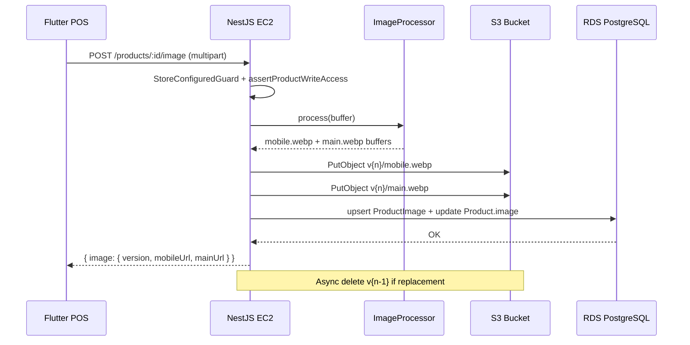

# Product Images — Análisis e implementación (S3 + PostgreSQL)

Plan de implementación para **Fase 2** (después del deploy estable en EC2 + RDS). Migrar imágenes de producto desde **disco local** hacia **S3 + metadatos en PostgreSQL**.

> **Fase 1 producción:** imágenes desactivadas vía `FEATURE_PRODUCT_IMAGES=0`. Este plan aplica al activar imágenes en **Fase 2**.

**Estado del documento:** planificación — **pospuesto (Fase 2)**  
**Última actualización:** 2026-06-10

---

## Índice

1. [Resumen ejecutivo](#1-resumen-ejecutivo)
2. [Estado actual del backend](#2-estado-actual-del-backend)
3. [Objetivo y principios](#3-objetivo-y-principios)
4. [Decisiones de arquitectura](#4-decisiones-de-arquitectura)
5. [Diseño modular propuesto](#5-diseño-modular-propuesto)
6. [Modelo de datos](#6-modelo-de-datos)
7. [S3: keys, permisos y lifecycle](#7-s3-keys-permisos-y-lifecycle)
8. [Contrato de API](#8-contrato-de-api)
9. [Procesamiento de imágenes](#9-procesamiento-de-imágenes)
10. [Seguridad, costos y observabilidad](#10-seguridad-costos-y-observabilidad)
11. [Compatibilidad con sync y frontend](#11-compatibilidad-con-sync-y-frontend)
12. [Plan de implementación paso a paso](#12-plan-de-implementación-paso-a-paso)
13. [Checklist maestro](#13-checklist-maestro)
14. [Riesgos y mitigaciones](#14-riesgos-y-mitigaciones)
15. [Referencias internas](#15-referencias-internas)

---

## 1. Resumen ejecutivo

El backend ya tiene un **MVP funcional** de imágenes en disco local (`ProductImagesController`), pero no cumple los requisitos de producción en EC2 + RDS + S3:

| Aspecto | Hoy | Objetivo |
|---------|-----|----------|
| Almacenamiento | `storage/products-images/{storeId}/` en EC2 | Bucket S3 único |
| Metadatos | Campo `Product.image` (string URL) | Tabla `product_images` + versión |
| Procesamiento | Ninguno (archivo tal cual) | WebP, 2 variantes (mobile/main) |
| Versionado | Nombre aleatorio por upload | `products/{id}/v{n}/mobile.webp` |
| Límite tamaño | 5 MB | **1 MB** (configurable) |
| Limpieza | Archivos huérfanos permanecen | Lifecycle S3 + job ops |
| AWS | No existe | IAM role + `@aws-sdk/client-s3` |

La implementación propuesta **no añade servicios extra** (sin Lambda, sin CloudFront al inicio, sin S3 versioning nativo). El backend en EC2 procesa, sube y expone URLs públicas versionadas para cache largo.

---

## 2. Estado actual del backend

### 2.1 Código existente relevante

| Archivo | Qué hace hoy |
|---------|--------------|
| `src/modules/products/product-images.controller.ts` | Upload multipart → disco, serve GET, PATCH attach, DELETE detach |
| `src/modules/products/products.service.ts` | CRUD; `Product.image` como string; `assertProductWriteAccess()` |
| `prisma/schema.prisma` | `Product.image String?` |
| `src/modules/products/product-pull-payload.ts` | Sync expone `image` como string plano |
| `docs/FRONTEND.md` §8 | Contrato actual: upload en 2 pasos (POST upload + PATCH attach) |

### 2.2 Autenticación / autorización (decisión acordada)

**No hay login de usuario ni JWT.** Cada dispositivo POS ya tiene el **`storeId`** (UUID de tienda) descargado en onboarding/sync. Todas las requests llevan:

```
X-Store-Id: <storeId del dispositivo>
```

El guard global `StoreConfiguredGuard` valida que la tienda exista y tenga `BusinessSettings`.

| Concepto del spec | Implementación Quick Market |
|-------------------|----------------------------|
| Autenticación upload | Header **`X-Store-Id`** (obligatorio) |
| `owner_id` en `product_images` | **`storeId`** del header (= tienda del dispositivo) |
| Autorización | `assertProductWriteAccess()` — el producto debe pertenecer a esa tienda (`catalogStoreId`) |
| Usuario IAM en AWS | **No** — solo IAM **Role** en EC2 |
| Usuario IAM dev local | **Omitido** — dev local usa `STORAGE_DRIVER=local` |
| Modelo `User` / `uploadedBy` | **Omitido** — no guardamos quién subió a nivel usuario |

**Flujo en el dispositivo:**

```
App Flutter (storeId en SQLite/local)
        │
        POST /products/:id/image
        Header: X-Store-Id: {storeId}
        Body: multipart file
        │
        ▼
Backend valida tienda + permiso sobre producto → procesa → S3 → DB
```

No hace falta crear usuarios en AWS ni en la app para este flujo.

### 2.3 Infraestructura objetivo (ya definida)

```
Cliente (Flutter POS)
        │
        ▼
  EC2 t4g.micro — NestJS /api/v1
        │
        ├──► RDS PostgreSQL db.t4g.micro  (solo keys + metadatos)
        │
        └──► S3 bucket único               (mobile.webp + main.webp por versión)
```

### 2.4 Gaps a construir

- [ ] Módulo `storage` (abstracción S3)
- [ ] Módulo/servicio `product-images` (procesamiento + persistencia)
- [ ] Tabla `ProductImage` en Prisma + migración
- [ ] Dependencias: `@aws-sdk/client-s3`, `sharp`
- [ ] Variables de entorno AWS/S3
- [ ] Política IAM en EC2 (fuera del repo, documentada aquí)
- [ ] Lifecycle rules S3 (Terraform/Console, documentadas)
- [ ] Job de limpieza (extender `ops` scheduler o tarea manual)
- [ ] Tests unitarios + integración
- [ ] Deprecación gradual del flujo disco local

---

## 3. Objetivo y principios

### 3.1 Responsabilidades del backend

1. **Recibir** la imagen (multipart, 1 archivo).
2. **Validar** tipo MIME real, tamaño y permiso sobre el producto.
3. **Procesar** en memoria: convertir a WebP, generar mobile + main, strip metadata EXIF.
4. **Subir** ambas variantes a S3 con keys versionadas.
5. **Persistir** keys y metadatos en PostgreSQL (nunca binarios).
6. **Exponer** al cliente la versión activa con URLs públicas armadas desde config.

### 3.2 Reglas anti-costo (obligatorias)

- [ ] No guardar el original en S3 (solo mobile + main procesados).
- [ ] No guardar binarios en PostgreSQL.
- [ ] Máximo **2 variantes** al inicio.
- [ ] Límite estricto de subida: **1 MB** (ajustable vía env).
- [ ] No activar S3 bucket versioning (usamos version en la key).
- [ ] Logs mínimos; sin SQL verbose en producción.
- [ ] IAM least privilege; sin `ListBucket` si no hace falta.

---

## 4. Decisiones de arquitectura

### 4.1 Endpoint unificado vs flujo en 2 pasos

**Decisión:** reemplazar el flujo `POST upload` + `PATCH attach` por un único endpoint atómico:

```
POST /api/v1/products/:id/image
```

**Por qué:**

- Valida permiso **antes** de aceptar bytes definitivos (Multer en memoria, no disco).
- Evita huérfanos por uploads que nunca se vinculan.
- Alineado con el spec del usuario.

**Compatibilidad (transición):** durante el desarrollo y despliegue inicial, los endpoints legacy siguen activos solo si `STORAGE_DRIVER=local`. Con `STORAGE_DRIVER=s3` el flujo nuevo es el único soportado.

**Fase final (acordado):** una vez S3 + Flutter validados en producción, **eliminar por completo** el código legacy (controller disco, `GET /uploads/...`, flag `local`). No queda modo dual permanente.

### 4.2 URLs públicas vs presigned

**Decisión inicial:** **bucket público solo lectura** en prefijo `products/*`, con Block Public Access parcialmente relajado solo para GetObject vía bucket policy.

**Por qué:** imágenes de catálogo POS no son datos sensibles; ahorra complejidad y CPU de firmar URLs en cada GET de producto.

**Alternativa documentada:** si más adelante hay contenido privado, cambiar a presigned URLs cortas sin cambiar el schema (solo `ProductImageUrlBuilder`).

### 4.3 `Product.image` vs tabla `product_images`

**Decisión:** tabla **`ProductImage`** como fuente de verdad; **`Product.image`** se mantiene temporalmente como **campo derivado** (URL main o JSON serializado) para no romper sync/cliente de golpe.

Estrategia de transición:

1. Fase A: escribir en `ProductImage` **y** actualizar `Product.image` con `mainUrl` (string).
2. Fase B: en respuestas REST enriquecer con objeto `image: { version, mobileUrl, mainUrl, updatedAt }`.
3. Fase C: sync pull incluye el objeto `image` además del string legacy.
4. Fase D (futuro): eliminar `Product.image` cuando el cliente Flutter migre.

### 4.4 Identificadores

El spec usa `product_id = 45` (entero). En este proyecto los IDs son **UUID**. Las keys S3 serán:

```
products/{productUuid}/v{n}/mobile.webp
products/{productUuid}/v{n}/main.webp
```

### 4.5 Procesamiento en EC2 vs servicio externo

**Decisión:** procesar con **`sharp`** en el mismo proceso NestJS.

En t4g.micro (ARM) `sharp` funciona bien; imágenes ≤1 MB y 2 variantes mantienen CPU acotada. Si el volumen crece, el módulo `ImageProcessorService` ya estará aislado para extraer a worker después.

---

## 5. Diseño modular propuesto

```
src/
├── modules/
│   ├── storage/                          # NUEVO — infra compartida S3
│   │   ├── storage.module.ts
│   │   ├── s3-storage.service.ts         # putObject, deleteObject, buildPublicUrl
│   │   ├── storage.config.ts             # env validation
│   │   └── storage.types.ts
│   │
│   └── products/
│       ├── product-images/               # NUEVO — dominio imágenes
│       │   ├── product-images.service.ts
│       │   ├── product-images.controller.ts  # reemplaza lógica actual
│       │   ├── image-processor.service.ts
│       │   ├── product-image-url.builder.ts
│       │   ├── dto/
│       │   │   └── product-image-response.dto.ts
│       │   └── product-images.constants.ts
│       ├── products.service.ts           # enriquecer findOne/findAll con image object
│       └── product-pull-payload.ts       # extender payload sync
│
└── modules/ops/
    └── product-image-cleanup.service.ts  # NUEVO — huérfanos DB↔S3 (opcional fase 6)
```

### 5.1 Responsabilidades por módulo

| Módulo / servicio | Responsabilidad |
|-------------------|-----------------|
| `StorageModule` | Cliente S3, config, URLs públicas, delete |
| `ImageProcessorService` | Validación buffer, resize, WebP, strip EXIF |
| `ProductImagesService` | Orquestación: permisos → procesar → S3 → DB → incrementar version |
| `ProductImageUrlBuilder` | `mainKey` + config → URL; sin URLs en DB |
| `ProductImagesController` | HTTP: POST/DELETE; Multer memory storage |
| `ProductImageCleanupService` | Job periódico: borrar versiones antiguas / temporales |

### 5.2 Wiring en NestJS

```typescript
// storage.module.ts
@Module({
  providers: [S3StorageService],
  exports: [S3StorageService],
})
export class StorageModule {}

// products.module.ts
@Module({
  imports: [InventoryModule, StorageModule],
  controllers: [..., ProductImagesController],
  providers: [ProductsService, ProductImagesService, ImageProcessorService, ProductImageUrlBuilder],
  exports: [ProductImagesService],
})
export class ProductsModule {}
```

---

## 6. Modelo de datos

### 6.1 Tabla `product_images`

```prisma
model ProductImage {
  id          String   @id @default(uuid())
  productId   String   @unique          // 1 imagen activa por producto (v1)
  ownerId     String                    // storeId (X-Store-Id del dispositivo que subió)
  version     Int      @default(1)
  mobileKey   String
  mainKey     String
  mimeType    String   @default("image/webp")
  sizeBytes   Int                       // suma mobile + main (o solo main; documentar)
  width       Int                       // dimensiones de main
  height      Int
  createdAt   DateTime @default(now())
  updatedAt   DateTime @updatedAt

  product     Product  @relation(fields: [productId], references: [id], onDelete: Cascade)

  @@index([ownerId])
  @@index([productId])
  @@map("product_images")
}
```

En `Product`:

```prisma
model Product {
  // ... campos existentes ...
  image       String?       // LEGACY — mantener durante transición
  productImage ProductImage?
}
```

### 6.2 Reglas de versionado

| Evento | Comportamiento |
|--------|----------------|
| Primera subida | `version = 1`, keys `.../v1/mobile.webp`, `.../v1/main.webp` |
| Reemplazo | `version++`, nuevas keys; **no** sobrescribir v anterior |
| DELETE imagen | Borrar fila `ProductImage`, `Product.image = null`, opcional delete S3 v activa |
| Producto eliminado (soft) | Mantener imagen hasta hard delete; `onDelete: Cascade` si se borra producto |

### 6.3 Qué NO guardar en PostgreSQL

- Binarios / BYTEA
- URLs completas (solo keys; la base URL viene de `S3_PUBLIC_BASE_URL` o `{bucket}.s3.{region}.amazonaws.com`)
- Original sin procesar

### 6.4 Migración SQL (borrador)

```sql
CREATE TABLE "product_images" (
  "id"         TEXT NOT NULL,
  "product_id" TEXT NOT NULL,
  "owner_id"   TEXT NOT NULL,
  "version"    INTEGER NOT NULL DEFAULT 1,
  "mobile_key" TEXT NOT NULL,
  "main_key"   TEXT NOT NULL,
  "mime_type"  TEXT NOT NULL DEFAULT 'image/webp',
  "size_bytes" INTEGER NOT NULL,
  "width"      INTEGER NOT NULL,
  "height"     INTEGER NOT NULL,
  "created_at" TIMESTAMP(3) NOT NULL DEFAULT CURRENT_TIMESTAMP,
  "updated_at" TIMESTAMP(3) NOT NULL,

  CONSTRAINT "product_images_pkey" PRIMARY KEY ("id"),
  CONSTRAINT "product_images_product_id_key" UNIQUE ("product_id"),
  CONSTRAINT "product_images_product_id_fkey"
    FOREIGN KEY ("product_id") REFERENCES "Product"("id") ON DELETE CASCADE ON UPDATE CASCADE
);

CREATE INDEX "product_images_owner_id_idx" ON "product_images"("owner_id");
CREATE INDEX "product_images_product_id_idx" ON "product_images"("product_id");
```

---

## 7. S3: keys, permisos y lifecycle

### 7.1 Convención de keys

```
products/{productId}/v{version}/mobile.webp
products/{productId}/v{version}/main.webp
temp/{uploadId}/...                    # solo si usamos staging (opcional)
```

Ejemplo:

```
products/550e8400-e29b-41d4-a716-446655440000/v2/mobile.webp
products/550e8400-e29b-41d4-a716-446655440000/v2/main.webp
```

### 7.2 Configuración del bucket

| Setting | Valor recomendado |
|---------|-------------------|
| Block Public Access | Activado globalmente **excepto** policy de lectura en `products/*` |
| Encryption | SSE-S3 (AES256) |
| HTTPS | `"aws:SecureTransport": "true"` en bucket policy |
| Versioning | **Desactivado** (versionado lógico en key) |
| CORS | Solo si el cliente sube directo a S3 (no aplica en v1) |

### 7.3 IAM role EC2 (least privilege)

Policy mínima (ajustar `BUCKET_NAME`):

```json
{
  "Version": "2012-10-17",
  "Statement": [
    {
      "Sid": "ProductImagesWrite",
      "Effect": "Allow",
      "Action": ["s3:PutObject", "s3:DeleteObject"],
      "Resource": "arn:aws:s3:::BUCKET_NAME/products/*"
    },
    {
      "Sid": "ProductImagesReadForOps",
      "Effect": "Allow",
      "Action": ["s3:GetObject"],
      "Resource": "arn:aws:s3:::BUCKET_NAME/products/*"
    }
  ]
}
```

**No incluir:** `s3:ListBucket`, `s3:*`, acceso a otros prefijos.

**Preferir:** IAM instance profile en EC2, **sin** access keys en `.env`.

### 7.4 Credenciales AWS — SDK vs “¿tengo que crear keys?”

#### Respuesta corta

| Dónde corre la app | ¿Access keys en `.env`? | ¿Qué hace falta? |
|--------------------|-------------------------|------------------|
| **EC2 producción** | **No** | IAM **Role** en la instancia + SDK + bucket/región en `.env` |
| **Tu PC (local)** | **No** | `STORAGE_DRIVER=local` — desarrollo sin S3 |
| **Tu PC → bucket real** | Sí | **Omitido** — no usaremos este camino |

El **SDK no sustituye las credenciales**: es la librería que llama a S3. AWS **siempre** exige identidad. Lo que cambia es **cómo** la obtiene el SDK:

```
@aws-sdk/client-s3 (NestJS)
       │
       ├─► EC2: credenciales TEMPORALES vía IAM Role (automático, sin keys en .env)
       │
       └─► Local: STORAGE_DRIVER=local → no llama S3
```

**En producción creas solo:**

1. Bucket S3  
2. IAM **Role** (no “usuario”) con Put/Get/Delete en `products/*`  
3. Asociar el rol a la EC2  

`.env` producción: `AWS_REGION`, `S3_BUCKET`, `S3_PUBLIC_BASE_URL`. **Sin** `AWS_ACCESS_KEY_ID`.

#### Producción (EC2) — IAM Role, sin access keys

| Paso | Dónde (AWS Console) | Acción |
|------|---------------------|--------|
| 1 | **IAM → Roles → Create role** | Trusted entity: **AWS service → EC2** |
| 2 | Mismo rol | Attach policy custom (sección 7.3) o inline policy `QuickMarketProductImagesS3` |
| 3 | **EC2 → Instances → tu instancia → Actions → Security → Modify IAM role** | Asignar el rol creado |
| 4 | Reiniciar app NestJS | El SDK detecta credenciales temporales del metadata service automáticamente |
| 5 | `.env` en EC2 | Solo `AWS_REGION`, `S3_BUCKET`, `S3_PUBLIC_BASE_URL` — **sin keys** |

**Verificación en EC2:**

```bash
# Desde la instancia (debe devolver credenciales temporales)
curl -s http://169.254.169.254/latest/meta-data/iam/security-credentials/
```

#### Desarrollo local — sin credenciales AWS (decisión acordada)

**No crear IAM User ni access keys para dev local.**

| Entorno | Config |
|---------|--------|
| PC desarrollo | `STORAGE_DRIVER=local` — flujo actual en disco |
| Tests Jest | Mock del cliente S3 |
| Prueba real S3 | Deploy en EC2 con IAM Role, o smoke test contra API desplegada |

Cuando quieras probar S3 de verdad, hazlo **desde la EC2** (ya con rol) o contra la **API en staging/producción**, no desde keys en tu `.env` local.

#### Resumen por entorno

| Entorno | Método | ¿Access keys? |
|---------|--------|---------------|
| **EC2 producción** | IAM Instance Profile + SDK | **No** |
| **Dev local** | `STORAGE_DRIVER=local` | **No** |
| **CI/tests** | Mock S3 | **No** |

#### Qué NO hace falta crear

- **Usuario root** de la cuenta AWS — nunca para la app.
- **IAM User + access keys** — omitido (dev local sin S3).
- **Access keys en el rol EC2** — los roles usan credenciales temporales automáticas.
- **Política AdministratorAccess** — solo la policy mínima de §7.3.
- **CloudFront / Lambda** — fuera de alcance v1.

### 7.5 Lifecycle rules

| Regla | Prefijo | Acción |
|-------|---------|--------|
| Temp cleanup | `temp/` | Expirar objetos a los **3 días** |
| (Opcional) Abort MPU | — | Abort incomplete multipart uploads **7 días** |

**Versiones antiguas (`v1`, `v2`…):** el backend las borra al confirmar reemplazo (fase 6), no depender solo de lifecycle.

### 7.6 Variables de entorno nuevas

Añadir a `.env.example`:

```bash
# --- Storage S3 ---
AWS_REGION=us-east-1
S3_BUCKET=quickmarket-product-images
# Base pública para armar URLs (sin trailing slash)
S3_PUBLIC_BASE_URL=https://quickmarket-product-images.s3.us-east-1.amazonaws.com
# En EC2 con IAM role, omitir keys:
# AWS_ACCESS_KEY_ID=
# AWS_SECRET_ACCESS_KEY=

# --- Product images ---
PRODUCT_IMAGE_MAX_BYTES=1048576          # 1 MB
PRODUCT_IMAGE_MOBILE_MAX_WIDTH=480
PRODUCT_IMAGE_MAIN_MAX_WIDTH=1200
PRODUCT_IMAGE_WEBP_QUALITY=80
# local | s3 — permite dev local sin AWS
STORAGE_DRIVER=s3
```

---

## 8. Contrato de API

### 8.1 Subir / reemplazar imagen

```
POST /api/v1/products/:id/image
Headers: X-Store-Id, Content-Type: multipart/form-data
Body: file (1 archivo)
```

**Respuesta 200:**

```json
{
  "productId": "550e8400-e29b-41d4-a716-446655440000",
  "image": {
    "version": 2,
    "mobileUrl": "https://bucket.s3.amazonaws.com/products/550e8400.../v2/mobile.webp",
    "mainUrl": "https://bucket.s3.amazonaws.com/products/550e8400.../v2/main.webp",
    "mobileKey": "products/550e8400.../v2/mobile.webp",
    "mainKey": "products/550e8400.../v2/main.webp",
    "width": 1200,
    "height": 800,
    "sizeBytes": 87432,
    "updatedAt": "2026-06-09T23:00:00.000Z"
  }
}
```

**Errores:**

| Código | Caso |
|--------|------|
| 400 | Sin archivo, MIME no permitido, tamaño excedido, no es imagen válida |
| 403 | Producto de otra tienda |
| 404 | Producto no encontrado |
| 413 | Payload too large (Multer) |
| 500 | Fallo S3 / procesamiento (log error, mensaje genérico al cliente) |

### 8.2 Eliminar imagen

```
DELETE /api/v1/products/:id/image
```

Respuesta: producto actualizado con `image: null` y sin objeto `productImage`.

### 8.3 GET producto (enriquecido)

`GET /api/v1/products/:id` y listados incluyen:

```json
{
  "id": "550e8400-...",
  "name": "Producto X",
  "image": "https://.../v2/main.webp",
  "productImage": {
    "version": 2,
    "mobileUrl": "...",
    "mainUrl": "...",
    "updatedAt": "2026-06-09T23:00:00.000Z"
  }
}
```

`image` (string) se mantiene por compatibilidad = `mainUrl`.

### 8.4 Endpoints legacy (transición → eliminación)

| Fase | Endpoint actual | Comportamiento |
|------|-----------------|----------------|
| Transición | `POST /uploads/products-image` | Solo si `STORAGE_DRIVER=local` |
| Transición | `GET /uploads/products-image/:storeId/:file` | Solo si `STORAGE_DRIVER=local` |
| Transición | `PATCH /products/:id/image` | Solo si `STORAGE_DRIVER=local` |
| **Fase 9 final** | Los 3 anteriores | **Eliminar código** (no 410 permanente) |

Con `STORAGE_DRIVER=s3` desde el primer deploy productivo, esos endpoints ni siquiera se registran o responden 404.

### 8.5 Rate limiting

No existe hoy en el proyecto. **Recomendación mínima:** middleware simple in-memory por `storeId` en `ProductImagesController` (ej. 30 uploads / hora / tienda) o `@nestjs/throttler` en fase posterior.

---

## 9. Procesamiento de imágenes

### 9.1 Pipeline (`ImageProcessorService`)

```
Buffer upload
    │
    ├─► sharp(buffer).metadata()     → rechazar si no es imagen
    ├─► strip EXIF                     → rotate() auto + withMetadata({})
    │
    ├─► mobile: resize width ≤ 480, fit inside, webp q=80
    └─► main:   resize width ≤ 1200, fit inside, webp q=80
```

### 9.2 Validaciones (antes de procesar)

| Check | Implementación |
|-------|----------------|
| MIME permitido | `image/jpeg`, `image/png`, `image/webp` únicamente |
| MIME vs contenido | `sharp` falla → 400 |
| Extensión engañosa | Ignorar extensión; confiar en magic bytes vía sharp |
| Tamaño | Multer `limits.fileSize` + env `PRODUCT_IMAGE_MAX_BYTES` |
| Dimensiones máximas | Opcional: rechazar si main > 4000px (anti-DoS) |

### 9.3 MIME excluidos deliberadamente

- `image/gif` — animaciones no necesarias en catálogo POS; ahorra casos raros.
- Cualquier `image/*` genérico — lista blanca estricta.

### 9.4 ¿El límite de 1 MB afecta la calidad?

**No directamente.** Son dos cosas distintas:

| Concepto | Qué limita | Efecto en calidad |
|----------|------------|-------------------|
| **`PRODUCT_IMAGE_MAX_BYTES` (1 MB)** | Tamaño máximo del **archivo que sube el cliente** | Solo rechaza uploads demasiado grandes. No comprime ni degrada. |
| **`PRODUCT_IMAGE_MAIN_MAX_WIDTH` (1200px)** | Ancho máximo de la variante **main** | Sí reduce resolución si la foto original es más grande (ej. 4000×3000 → 1200×900). |
| **`PRODUCT_IMAGE_MOBILE_MAX_WIDTH` (480px)** | Variante lista/card | Menor resolución a propósito; suficiente para thumbnails POS. |
| **`PRODUCT_IMAGE_WEBP_QUALITY` (80)** | Compresión WebP al **procesar** | Principal control de nitidez vs peso. 80 suele verse bien en catálogo. |

**Flujo real:**

```
Cliente sube JPEG 800 KB (1920×1080)  ← dentro del límite 1 MB ✓
        ↓
Backend procesa con sharp
        ↓
main.webp   ~60–120 KB  (1200px max, q=80)
mobile.webp ~15–40 KB   (480px max, q=80)
        ↓
S3 guarda solo esas 2 variantes (no el original)
```

**Cuándo sí notarías pérdida de calidad:**

- Foto **ya muy comprimida** por el cliente antes de subir (ej. 200×200 px estirada).
- **`WEBP_QUALITY` muy bajo** (ej. 50) — no recomendado para catálogo.
- Original **enorme en píxeles** — el resize a 1200px es intencional (catálogo POS, no zoom artístico).

**Recomendación práctica:** 1 MB de entrada es holgado para fotos de producto típicas (720–1920 px bien comprimidas). La calidad visible la define **resize + quality WebP**, no el tope de upload. Si en pruebas ves artefactos, sube `WEBP_QUALITY` a 85 antes de subir el límite de MB.

**Valores de referencia para catálogo POS:**

| Variante | Ancho | Quality | Uso |
|----------|-------|---------|-----|
| mobile | 480px | 80 | Cards, listas, sync |
| main | 1200px | 80 | Detalle producto, pantallas grandes |

Salida típica total: **~80–150 KB** en S3 por producto (muy por debajo de 1 MB).

### 9.5 Flujo transaccional

```
1. assertProductInStoreCatalog + assertProductWriteAccess
2. Procesar buffer → { mobileBuffer, mainBuffer, width, height, sizeBytes }
3. Calcular nextVersion (1 o current+1)
4. PutObject mobile + main en S3 (orden: mobile primero)
5. prisma.$transaction:
     upsert ProductImage
     update Product.image = mainUrl
     append ServerChangeLog (PRODUCT_UPDATED)  ← mantener sync
6. Si paso 5 falla → best-effort delete objects subidos en paso 4
7. Si éxito y era reemplazo → async delete versión anterior en S3
```

---

## 10. Seguridad, costos y observabilidad

### 10.1 Seguridad

- [ ] Upload solo con `X-Store-Id` válido (guard global).
- [ ] Verificar ownership vía `catalogStoreId` antes de procesar.
- [ ] Multer **memoryStorage** — no escribir upload crudo a disco EC2.
- [ ] No loguear: contenido archivo, tokens, headers completos, bodies multipart.
- [ ] Mensajes de error genéricos al cliente en fallos S3.
- [ ] Path traversal: N/A en S3; keys generadas server-side only.

### 10.2 Logs (CloudWatch)

| Nivel | Qué loguear |
|-------|-------------|
| `error` | Fallo S3, fallo sharp, transacción DB fallida |
| `warn` | Upload rechazado por validación (sin dump binario) |
| `log` | Evento negocio: `product_image_uploaded productId=… version=… bytes=…` |

| Evitar | |
|--------|---|
| `console.log` debug | Eliminar en código nuevo |
| SQL verbose Prisma | `log: ['error']` en producción |
| Retención | 3–7 días en log groups (config AWS, no código) |

### 10.3 Observabilidad mínima

Monitorear (manual o CloudWatch alarms básicas):

- [ ] Tasa 5xx en `POST /products/:id/image`
- [ ] Tamaño bucket S3 (métrica `BucketSizeBytes`)
- [ ] Storage RDS (espacio libre)
- [ ] CPU EC2 durante uploads (picos sharp)

Evitar CloudWatch Logs Insights frecuentes (costo por scan).

### 10.4 Estimación de costo por imagen

Asumiendo main ~80 KB + mobile ~25 KB WebP:

- S3 storage: despreciable por imagen.
- S3 PUT: 2 requests por upload.
- S3 GET: servido directo desde S3 (sin pasar por EC2) → ahorro vs proxy actual.
- EC2 CPU: ~50–200 ms sharp en t4g.micro por upload.

---

## 11. Compatibilidad con sync y frontend

### 11.1 Sync pull (`product-pull-payload.ts`)

Fase A — mínimo breaking change:

```typescript
fields: {
  // ...existente...
  image: mainUrl,                    // string legacy
  productImageVersion: 2,            // nuevo opcional
  productImageMobileUrl: '...',      // nuevo opcional
}
```

Fase B — objeto anidado cuando el cliente Flutter lo soporte.

### 11.2 Frontend (`docs/FRONTEND.md`)

Actualizar §8:

- Un solo paso: `POST /products/:id/image` con multipart.
- Usar `productImage.mobileUrl` en listas/cards, `mainUrl` en detalle.
- Cache: URLs versionadas permiten `Cache-Control: public, max-age=31536000, immutable` en S3 metadata al subir.

### 11.3 Cliente offline

El POS cachea catálogo vía sync pull. Al cambiar imagen, el **`version`** incrementado cambia la URL → invalidación natural sin purge CDN.

---

## 12. Plan de implementación paso a paso

Cada fase es mergeable de forma independiente. Marcar `[x]` al completar.

---

### Fase 0 — Preparación AWS e infra (fuera del código)

**S3 y bucket**

- [ ] **0.1** Crear bucket S3 (misma región que EC2, ej. `us-east-1`) con cifrado SSE-S3
- [ ] **0.2** Configurar bucket policy: lectura pública solo `products/*` + `aws:SecureTransport`
- [ ] **0.5** Lifecycle rule: expirar `temp/*` a 3 días
- [ ] **0.6** Anotar `S3_BUCKET`, `AWS_REGION`, `S3_PUBLIC_BASE_URL` para `.env` producción

**Credenciales producción (EC2 — sin access keys)**

- [ ] **0.3** IAM → Create role → trusted entity **EC2**
- [ ] **0.3b** Adjuntar policy inline (PutObject, GetObject, DeleteObject solo en `arn:aws:s3:::BUCKET/products/*`)
- [ ] **0.4** EC2 → Modify IAM role → asignar rol a la instancia API
- [ ] **0.4b** Verificar metadata IAM desde la instancia (`curl 169.254.169.254/...`)
- [ ] **0.4c** Confirmar `.env` producción **sin** `AWS_ACCESS_KEY_ID` / `AWS_SECRET_ACCESS_KEY`

~~**Credenciales desarrollo local**~~ — **omitido:** dev local usa `STORAGE_DRIVER=local` (sin IAM User ni keys).

---

### Fase 1 — Dependencias y configuración

- [ ] **1.1** Instalar `@aws-sdk/client-s3` y `sharp`
- [ ] **1.2** Añadir variables a `.env.example` (sección Storage S3)
- [ ] **1.3** Crear `src/modules/storage/storage.config.ts` con validación al boot
- [ ] **1.4** Crear `StorageModule` + `S3StorageService` (put, delete, buildUrl)
- [ ] **1.5** Test unitario mock S3 client (put/delete/url builder)

---

### Fase 2 — Schema y migración

- [ ] **2.1** Añadir model `ProductImage` a `prisma/schema.prisma`
- [ ] **2.2** Ejecutar `prisma migrate dev` → migración `add_product_images`
- [ ] **2.3** Verificar índices `product_id`, `owner_id`
- [ ] **2.4** Actualizar `docs/DATABASE_SCHEMA_GUIDE.md` (tabla nueva)

---

### Fase 3 — Procesamiento de imagen

- [ ] **3.1** Crear `ImageProcessorService` con sharp
- [ ] **3.2** Implementar validación MIME lista blanca
- [ ] **3.3** Generar variantes mobile (480px) y main (1200px) WebP
- [ ] **3.4** Strip EXIF / auto-orient
- [ ] **3.5** Tests unitarios: jpeg/png/webp válidos; rechazo gif; rechazo > max bytes

---

### Fase 4 — Servicio de dominio

- [ ] **4.1** Crear `ProductImageUrlBuilder`
- [ ] **4.2** Crear `ProductImagesService.upload(productId, buffer, mime, ctx)`
- [ ] **4.3** Implementar incremento de version y upsert transaccional
- [ ] **4.4** Actualizar `Product.image` (legacy) con mainUrl
- [ ] **4.5** Registrar `ServerChangeLog` PRODUCT_UPDATED post-upload
- [ ] **4.6** Implementar `ProductImagesService.remove(productId, ctx)`
- [ ] **4.7** Compensación: delete S3 si falla commit DB
- [ ] **4.8** Post-reemplazo: delete versión anterior S3 (async, best-effort)

---

### Fase 5 — Capa HTTP

- [ ] **5.1** Refactor `ProductImagesController` → Multer memoryStorage
- [ ] **5.2** `POST /products/:id/image` → delegar a `ProductImagesService`
- [ ] **5.3** `DELETE /products/:id/image` → delegar a remove
- [ ] **5.4** DTOs con class-validator + Swagger
- [ ] **5.5** Enriquecer `ProductsService.findOne/findAll` con objeto `productImage`
- [ ] **5.6** Marcar endpoints legacy `@ApiDeprecated()` o guard por `STORAGE_DRIVER`

---

### Fase 6 — Limpieza y ops

- [ ] **6.1** Crear `ProductImageCleanupService` en módulo ops
- [ ] **6.2** Integrar en `OpsSchedulerService` (tick semanal o configurable)
- [ ] **6.3** Lógica: detectar keys S3 bajo `products/` sin fila DB activa (requiere ListBucket puntual **solo en job ops** — IAM separado o permiso temporal)
- [ ] **6.4** Endpoint ops métrica: contador imágenes / bytes estimados (opcional)

> **Nota:** el job de huérfanos puede necesitar `s3:ListBucket` en un rol ops separado, no en el rol de la API. Documentar en runbook.

---

### Fase 7 — Sync y documentación

- [ ] **7.1** Extender `product-pull-payload.ts` con campos version/URLs
- [ ] **7.2** Actualizar `docs/FRONTEND.md` §8
- [ ] **7.3** Actualizar colección Postman
- [ ] **7.4** Actualizar `docs/PROJECT_CONTEXT.md` (módulo storage)

---

### Fase 8 — Tests e integración

- [ ] **8.1** Tests unitarios `ProductImagesService` (mock storage + processor + prisma)
- [ ] **8.2** Test integración `RUN_INTEGRATION=1` con LocalStack o bucket dev
- [ ] **8.3** Test e2e: POST imagen → GET producto → verificar URLs
- [ ] **8.4** Test autorización: tienda B no puede subir imagen a producto tienda A

---

### Fase 9 — Despliegue, migración y limpieza final

- [ ] **9.1** Deploy a EC2 con `STORAGE_DRIVER=s3` + IAM role (sin keys en `.env`)
- [ ] **9.2** Script one-shot: migrar productos con `Product.image` local → S3 (opcional)
- [ ] **9.3** Smoke test desde app Flutter (upload + listado + sync)
- [ ] **9.4** Verificar CloudWatch: retención 3–7 días
- [ ] **9.5** **Eliminar endpoints legacy** (`POST/GET uploads`, `PATCH attach`, lógica disco, flag `STORAGE_DRIVER=local`)
- [ ] **9.6** Eliminar carpeta `storage/products-images/` del servidor si ya no hay referencias

---

## 13. Checklist maestro

Checklist corto de requisitos funcionales y no funcionales. Marcar al validar en producción.

### Funcional

- [ ] Autenticación obligatoria en uploads (`X-Store-Id`)
- [ ] Autorización por dueño de catálogo (`catalogStoreId`)
- [ ] Validación MIME lista blanca + magic bytes
- [ ] Límite tamaño ≤ 1 MB
- [ ] Conversión a WebP
- [ ] Solo 2 variantes (mobile + main)
- [ ] Versionado en key S3 (`v{n}`)
- [ ] Metadata en PostgreSQL, sin binarios
- [ ] Respuesta producto con objeto `image` versionado
- [ ] DELETE elimina metadata + objetos S3 activos

### Seguridad y AWS

- [ ] IAM role EC2 (sin access keys en repo)
- [ ] Permisos solo `products/*`
- [ ] Sin ListBucket en rol API
- [ ] SSE-S3 activo
- [ ] SecureTransport en bucket policy
- [ ] Block Public Access configurado correctamente

### Costos y operación

- [ ] No se guarda original
- [ ] No S3 bucket versioning
- [ ] Lifecycle temp/ abort MPU
- [ ] Limpieza versiones antiguas al reemplazar
- [ ] Logs mínimos (error/warn/evento negocio)
- [ ] Sin SQL verbose en producción
- [ ] Retención CloudWatch 3–7 días

### Calidad

- [ ] Tests unitarios processor + service
- [ ] Test integración upload flow
- [ ] Documentación FRONTEND + Postman actualizada
- [ ] Sync pull compatible

---

## 14. Riesgos y mitigaciones

| Riesgo | Impacto | Mitigación |
|--------|---------|------------|
| CPU saturada en t4g.micro con muchos uploads | API lenta | Límite rate por tienda; cola futura si crece |
| Upload OK a S3 pero falla DB | Objeto huérfano | Compensating delete; lifecycle temp; job ops |
| Cliente Flutter aún usa flujo 2 pasos | Regresión UX | Legacy solo con `STORAGE_DRIVER=local` hasta fase 9; luego borrar código |
| `sharp` en ARM (t4g) | Build fallido | Usar sharp prebuilt; probar en CI ARM |
| Sync offline con URL antigua | Imagen stale | Incluir `version` en pull; cliente refresca si version cambia |
| ListBucket para cleanup | Permiso extra | Rol ops separado; no ampliar rol API |

---

## 15. Referencias internas

| Recurso | Ruta |
|---------|------|
| Controller actual | `src/modules/products/product-images.controller.ts` |
| Product service | `src/modules/products/products.service.ts` |
| Prisma schema | `prisma/schema.prisma` |
| Store guard | `src/common/guards/store-configured.guard.ts` |
| Ops scheduler | `src/modules/ops/ops-scheduler.service.ts` |
| Sync payload | `src/modules/products/product-pull-payload.ts` |
| Contrato frontend | `docs/FRONTEND.md` |
| Contexto proyecto | `docs/PROJECT_CONTEXT.md` |

---

## Diagrama de flujo (upload)



---

## Próximo paso recomendado

Comenzar por **Fase 0** (AWS) en paralelo con **Fase 1** (módulo `storage` en local con `STORAGE_DRIVER=local` mock) para no bloquear desarrollo.

Cuando confirmes, avanzamos fase por fase marcando el checklist en este mismo archivo.
